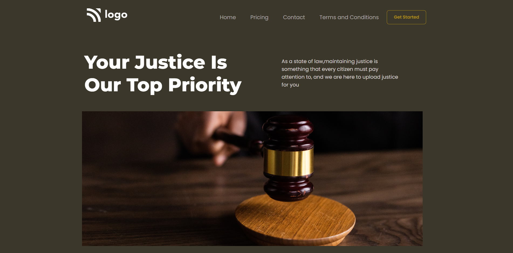

# Work of project 6

In this project the assets are provided and the output image for make this output as it is. I can write html and css code files. So in this project i can use max-width,margin,padding,flex,position properties and font-family etc css properties to make the output.

[Live Link]()

## Here is my Output

